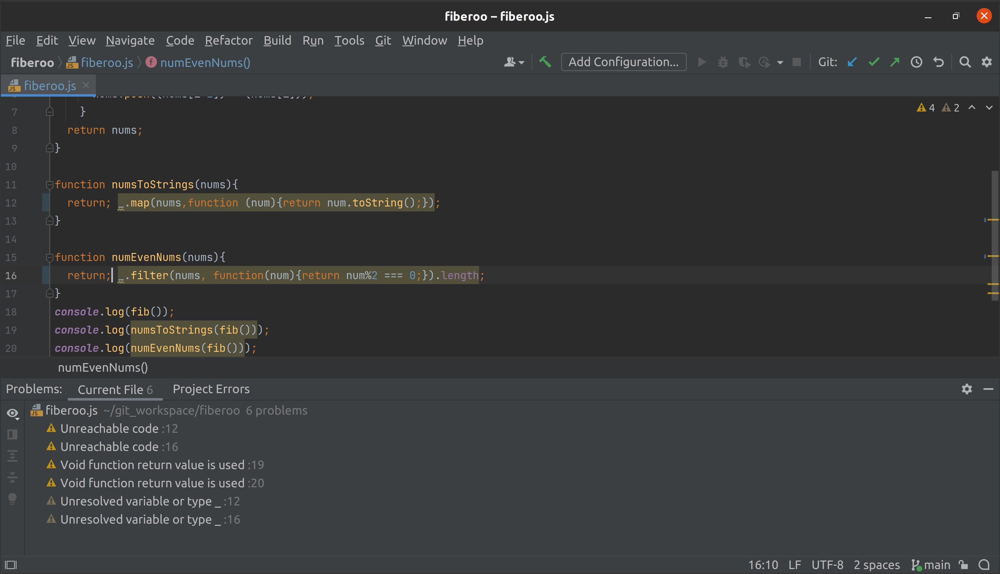

  Coding standard makes the code more readable, when everyone following the same rules and format. Other than making code looks nicer and organized, coding standard also includes the standard of the code quality. The organized code makes people to detect their errors easily and improve their code quality. Once the code quality being better and better, the ability of solving real life problems with programming skill will grow.  
  

  

  While using ESLint in IntelliJ, it does help a lot with coding speed because I always missing a semicolon or having typos on my code. Some complier would not tell the problems like that, so it might takes a lot of time to figure out what is missing in my code. ESLint avoid the potential bugs like disallow unreachable code after `return`, `throw`, `continue`, and `break` statements, or states out the variables that your not using with red lines. ESLint can also checks amd fixes the problem automatically, so many errors can be avoid by that. People can also makes their own rules by create an EsLint plugin.  
  
  At the time I'm using ESLint, it will needs to download three files in your project folder/directory, which will be name with ` .eslintrc`, `package.json`, and `.gitignore`. In the ` .eslintrc` file, it is for setting the coding standard. In the `.gitignore` file untracked the file that git should ignore. Then runnning the command `npm install` in the current project folder to install ESLint. After installed the IntelliJ page will appear a green check mark on the right hand side. (showed on the picture above). 
