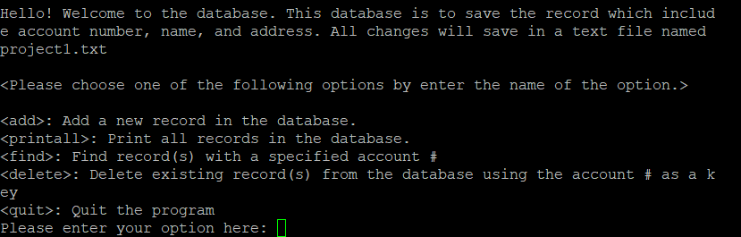

  

  This project is to build a database with add, print, find, and delete informations in a txt file.  
In the user interface, user can enter any letter within the option to execute the method except <quit> method. For example <add>, enter 'a' will allow user to go in the add method.  
"add" this will be asking for the account number, name, and address. Once more than one record in the database, the records will be stored in small to large order by the account number.  
"printAll" this will print all the records in the database.  
"delete" this will search the record with the account number user entered to delete it.  
"quit" leave the database and all the records will be store in txt file.  
 
<a href="database.c">Download File</a>
<a href="database.h">Download File</a>
<a href="user_interface.c">Download File</a>
<a href="record.h">Download File</a>
